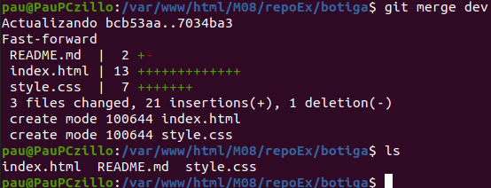

# Exercici Git
---
**1. Crea un repositori buit anomenat «botiga». Crea un fitxer anomenat «readme.md» ,
inclou-lo en «stage» i fes-ne «commit». Indica les comanda que has utilitzat en cada
pas.**

**2. Crea una branca «dev» al repositori creat en el punt anterior i situa’t dins d’aquesta
branca.   Indica   la   comanda   que   has   utilitzat.   Aquesta   branca   «dev»   serà   la   que
utilitzarem per treballar mentre desenvolupem.**

**3. Crea   en   el   repositori   que   has   creat   els   fitxers   «index.html»,   «style.css».   Dóna’ls-hi
contingut posant un header de nivell 1 en el fitxer «index.html» amb el text «Botiga».
Amb el fitxer «style.css» fes que el text sigui de color verd i el fons de la pàgina de
color negre. Adjunta una captura de pantalla amb el resultat de la comanda que indica
l’estat del directori**

**4. Executa   la   comanda   per   fer   commit   de   la   branca   amb   el   text   informatiu   «intent   de
commit». Adjunta una captura de pantalla amb el resultat de l’execució de la comanda.
Què ens indica el missatge que ha aparegut per pantalla?**

**5. Escriu les comandes per fer que el commit del punt anterior es faci efectiu.**

**6. Escriu  les comandes per  canviar  a la  branca  «master». Executa la  comanda  «ls»  i
adjunta una captura de pantalla. Explica per que no apareixen tots els fitxers que hem
creat a l’executar la comanda «ls»**

- no apareixen els fitxers que hem creat a la branca dev perqué no les hem fusionat.

**7. magina que la branca «dev» ja és definitva. Escriu la comanda que caldria executar per tal que el contingut de la branca «dev» passi a la branca «master». Adjunta una
captura de pantalla de l’execució de la comanda «ls» en el directori del repositori.**

Desde la brànca master hem d'escriure: `git merge dev`

**8. Imagina   que   en  aquest   punt   ens   demanen   programar   unes   funcionalitats   noves   en
javascript.   Crea   una   nova   branca   sobre   «dev»,   i   crea   un   fitxer   anomenat
«javascript.js». Escriu les comandes que has utilitzat per crear-la**

**9. En aquest punt, ens avisen que hi hagut un problema a la web que cal solucionar de
forma  urgent.   Crea   una  nova   branca  sobre  «dev»  anomenada   «ticket1».   Escriu   les
comandes que has utlitzat per crear-la**

**10. Dins   la   branca   «ticket1»   modifica   el   fitxers   per   tal   que   ara   les   lletres   del   fitxer
«index.html» apareguin de color vermell. Quan ho tinguis fet fes-ne el commit indicant
el missatge «solucionat ticket1» i uneix els canvis a «master». Indica les comandes
que has utilitzat.**

**11. Donen per tancat el ticket1. Elimina la branca que hem fet per solucionar-lo. Escriu les
comandes utilitzades.**

